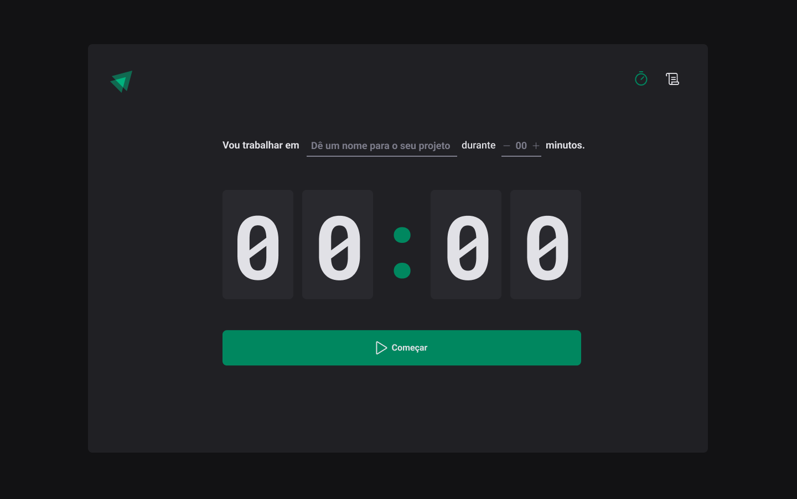

<h2 align="center">
  
</h2>

<p align="center">
  <a href="mailto:bortolettohenrique@gmail.com" target="_blank">
    
  </a>
  <a href="https://www.linkedin.com/in/henriquebortoletto/" target="_blank">
    
  </a>
</p>

---

### Timer

Projeto simples de timer estilo pomodoro com foco em aprofundar nos conceitos como `css-in-js`, `routes`, `side-effects`, `controlled e uncontrolled components`, `context api`, `useReducer`, `lazy initialization` e `validacões`.

---

### Tecnologias

- [x] `react-router-dom`
- [x] `styled-components`
- [x] `react-hook-form`
- [x] `zod`
- [x] `immer`
- [x] `typescript`

---

### Instalação

```bash
  # Clonar o repositório
  $ git clone

  # Entrar no diretório
  $ cd react-ignite-timer

  # Instalar as dependências
  $ yarn ou npm install

  # Iniciar o projeto
  $ yarn dev ou npm run dev
```

---
